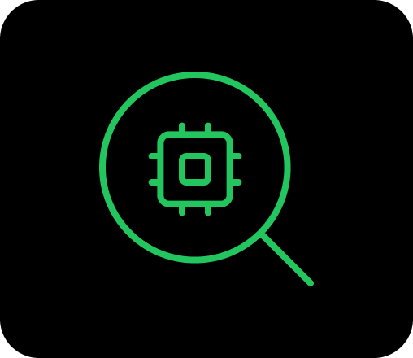
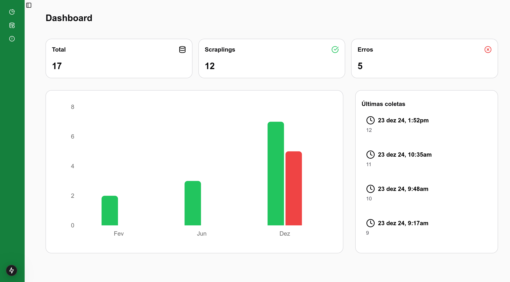
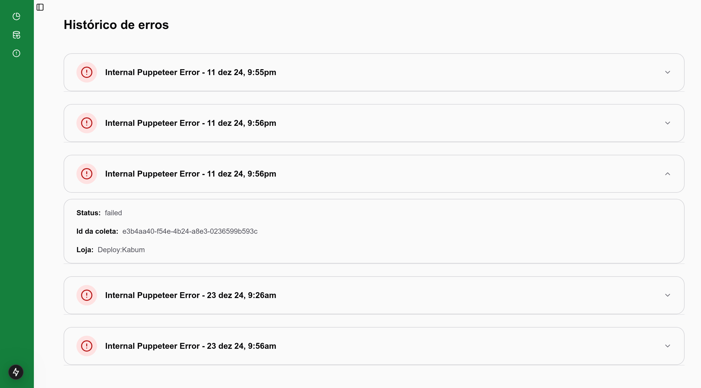
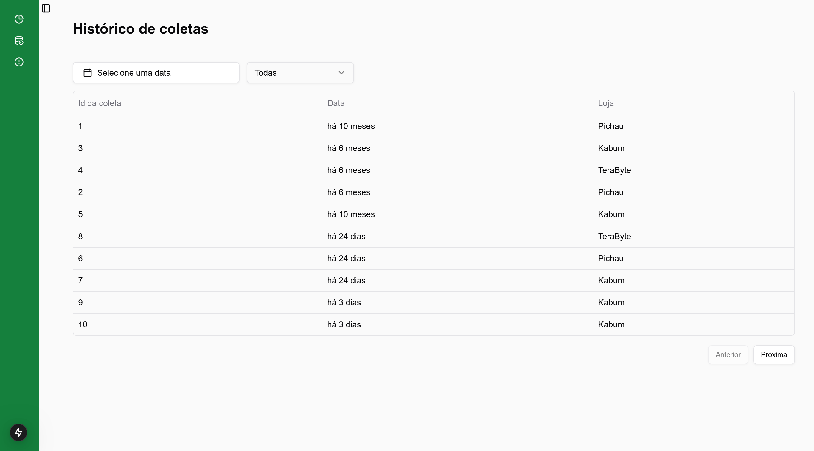

<p align="center">
  
</p>

## <p align="center">Hardware Price Tracker - App</p>

<p align="center">
   
   
    
    20-white?style=for-the-badge" />
</p>

O Hardware Price Tracker é uma plataforma online desenvolvida para facilitar a busca por produtos de hardware em três das principais lojas do segmento: Kabum, Pichau e Terabyte. Com ele, você pode comparar os preços de um mesmo produto para encontrar a melhor oferta e consultar o histórico de preços, ajudando a identificar os momentos mais vantajosos para sua compra. Além disso, o site oferece a possibilidade de criar uma conta para gerenciar alertas personalizados, permitindo que você seja notificado sempre que os produtos de interesse atingirem o preço desejado.

## 📸 Screenshots

 



## 🚀 Rodando localmente

Clone o projeto

```bash
  git clone https://github.com/ismael-henrique-dev/Hardware-Price-Tracker-Dashboard.git
```

Entre no diretório do projeto

```bash
  cd hardware-price-tracker-dashboard
```

Instale as dependências

```bash
  npm install
```

ou

```bash
  pnpm install
```

Inicie o servidor

```bash
  npm run dev
```

ou

```bash
  pnpm dev
```

## Backend da aplicação:

```bash
  https://github.com/cibatech/Hardware-Price-Tracker-API.git
```

## 💻 Tecnologias Utilizadas

- 
- 
- 
- 
- 
- 
- 
- 

## 🛠️ Funcionalidades

- Ver as estáticas do web-scrapling
- Histórico de coletas
- Histórico de erros

## 🎓 Aprendizado

O objetivo desse projeto foi aprender, com ele consegui aperfeiçoar meus conhecimentos em Nextjs,Reactjs, TypeScript e Tailwindcss. O foco também foi desenvolver o conhecimento em `Nextjs`, tive bastante dificuldade em implementar funcionalidades relacionadas à autenticação e roteamento do nextjs, mas após ler a documentação consegui resolver esse problema.
